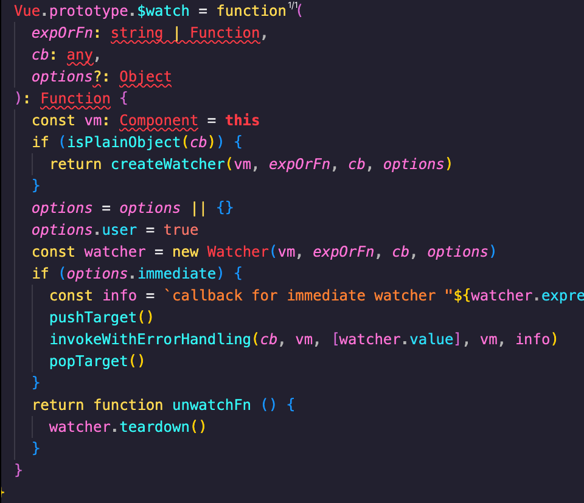

# watch监听

> 在开发过程中，有些情况会需要监听某些值的变化然后做一些额外的逻辑，vue给我们提供了`watch`监听器，可以帮助我们解决该场景

### 初始化 <a href="#init" id="init"></a>

在vue实例化的过程中，会执行原型上`_init`方法，该方法会依次执行一系列初始化过程，其中一项就是`initState`，该方法就对我们常用的data，props，watch等做了初始化。initState的代码路径在`src/core/instance/state.js`，在这内部就会判断是否传入了watch对象，然后初始化监听器

.png>)

### 创建监听 <a href="#create-listener" id="create-listener"></a>

`initWatch`的方法中会对`watch`对象遍历为每一个属性创建一个监听器，遍历过程中会对属性值做判断，如果是数组，则会遍历数组为每项创建一个监听器，创建监听器调用的是`$watch`方法，该方法在vue入口文件执行的`stateMixin`方法内挂载到原型上

.png>)

### 依赖收集 <a href="#dependency-collection" id="dependency-collection"></a>

* `Watcher`构造函数实例化时会调用内部的`get`方法，`get`方法会调用`pushTarget(this)`将当前的`watcher`赋值给`Dep.target`
* 调用`this.getter.call(vm, vm)`方法，在`initWatch`之前执行了`initData`，对`data`做了响应式处理，所以这里的`this.getter.call(vm, vm)`的调用会触发拦截的`get`函数，调用`dep.depend`进行依赖收集


```javascript
// /src/core/observer/index.js
// defineReactive函数
get: function reactiveGetter () {
  const value = getter ? getter.call(obj) : val
  if (Dep.target) {
    // 触发依赖收集
    dep.depend()
    if (childOb) {
      childOb.dep.depend()
      if (Array.isArray(value)) {
        dependArray(value)
      }
    }
  }
  return value
}
```


* 依赖收集完之后会重置`Dep.target`，因为只会有一个watcher执行。然后会清空依赖，这里的清空依赖是指对原有的依赖和新添加的依赖做一次整合，清理掉不存在新的依赖里的旧的依赖的订阅者，然后再将新的依赖赋值给旧的依赖，在清空新的依赖，用来下一次做依赖收集更新


```javascript
// /src/core/observer/watcher.js
cleanupDeps () {
  let i = this.deps.length
  while (i--) {
    const dep = this.deps[i]
    // 清理掉旧的订阅列表
    // 这里也可以看出依赖和观察者是一对多的关系，即一个依赖可以有多个watcher
    if (!this.newDepIds.has(dep.id)) {
      dep.removeSub(this)
    }
  }
  let tmp = this.depIds
  this.depIds = this.newDepIds
  this.newDepIds = tmp
  this.newDepIds.clear()
  tmp = this.deps
  this.deps = this.newDeps
  this.newDeps = tmp
  this.newDeps.length = 0
}
```


### 触发更新 <a href="#trigger-update" id="trigger-update"></a>

当值发生变化时，会触发数据拦截的`set`函数，对新值做判断，如果是对象，则转换成响应式对象。然后调用依赖的`notify`，触发`watcher`的`update`方法进行更新


```javascript
set: function reactiveSetter (newVal) {
  // 判断属性值是否设置了getter函数 
  const value = getter ? getter.call(obj) : val
  // 判断新旧值是否相等，相等则不更新
  if (newVal === value || (newVal !== newVal && value !== value)) {
    return
  }
  /* eslint-enable no-self-compare */
  if (process.env.NODE_ENV !== 'production' && customSetter) {
    customSetter()
  }
  // #7981: for accessor properties without setter
  if (getter && !setter) return
  if (setter) {
    setter.call(obj, newVal)
  } else {
    val = newVal
  }
  childOb = !shallow && observe(newVal)
  // 通知依赖进行更新
  dep.notify()
}
```


### 总结 <a href="#summary" id="summary"></a>

vue初始化时会对传入的`data`做响应式处理，同时对每一个属性建立一个`Dep`对象，用来存储`watcher`列表；然后初始化watch对象创建监听器，监听器会根据属性找到相对应的依赖，将自己添加到依赖的watcher列表；最后值发生变化触发依赖的`notify`通知监听器执行`update`函数调用传入的`回调函数`
